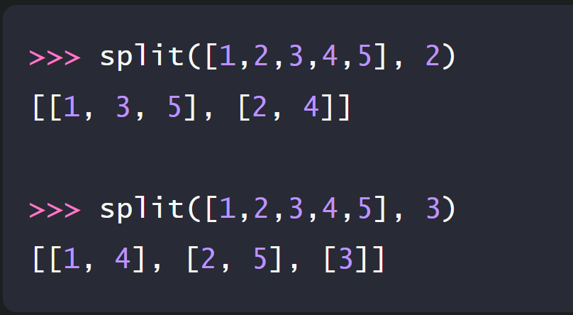
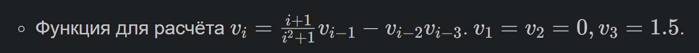

Задание 1 

## Условие задачи: 

Элементы распределяются по частям поочерёдно

Первый элемент попадает в первую часть, второй — во вторую, и так далее

Если элементов больше, чем частей, распределение продолжается с первой части

## Описание проделанной работы 

Были разработаны две функции для решения задачи:

Итеративная функция (без рекурсии) — с использованием цикла

Рекурсивная функция (с рекурсией) — функция вызывает саму себя

1. Итеративная функция (без рекурсии)
Алгоритм:

Создаём n пустых списков

Проходим по всем элементам исходного списка

Каждый элемент добавляем в список с индексом i % n

Возвращаем полученный результат

2. Рекурсивная функция (с рекурсией)
Алгоритм:

Базовый случай: если список пуст, возвращаем n пустых списков

Рекурсивно обрабатываем список без последнего элемента

Добавляем последний элемент в нужную часть

Возвращаем полученный результат

## Скриншоты результатов 

## Ссылки на используемые материалы

https://ru.wikipedia.org/wiki/Рекурсия_(программирование)
https://ru.wikipedia.org/wiki/Итерация_(программирование)

Задание 2

## Условие задачи: 

- Последовательно вычисляем значения от 4 до нужного индекса
- Храним только три последних значения (v_{i-3}, v_{i-2}, v_{i-1})
- На каждом шаге вычисляем новое значение по формуле
- Сдвигаем переменные для следующей итерации

## Описание проделанной работы 

1. Анализ задачи

Из условия известно:

Первые три элемента заданы явно: 

Каждый следующий элемент вычисляется через три предыдущих

2. Разработка итеративной функции

Итеративный подход заключается в последовательном вычислении элементов от начальных значений до нужного индекса.

Алгоритм:

Проверяем базовые случаи (i = 1, 2, 3)

Создаём переменные для хранения трёх последних значений

В цикле от 4 до i вычисляем новое значение по формуле

Обновляем переменные (сдвигаем значения)

Возвращаем результат

3. Разработка рекурсивной функции

Рекурсивный подход заключается в определении функции через саму себя.

Алгоритм:

Задаём базовые случаи (i = 1, 2, 3)

Для i > 3 функция вызывает себя для i-1, i-2, i-3

Результат вычисляется по формуле с использованием рекурсивных вызовов

Преимущества метода:

Код максимально близок к математической формуле

Легко читается и понимается

4. Тестирование функций

Было проведено тестирование на первых 8 значениях последовательности. Результаты обеих функций совпали, что подтверждает корректность реализации.

## Скриншоты результатов

## Ссылки на используемые материалы

https://ru.wikipedia.org/wiki/Рекурсия_(программирование)
https://ru.wikipedia.org/wiki/Итерация_(программирование)
